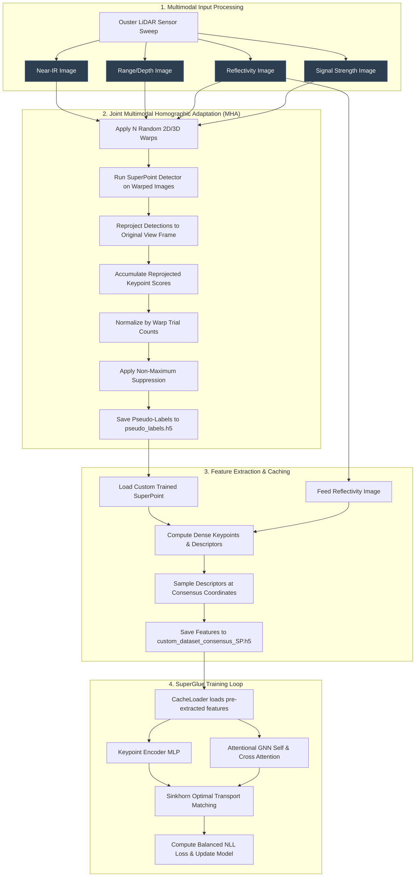
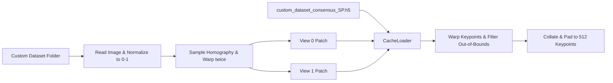
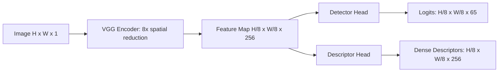
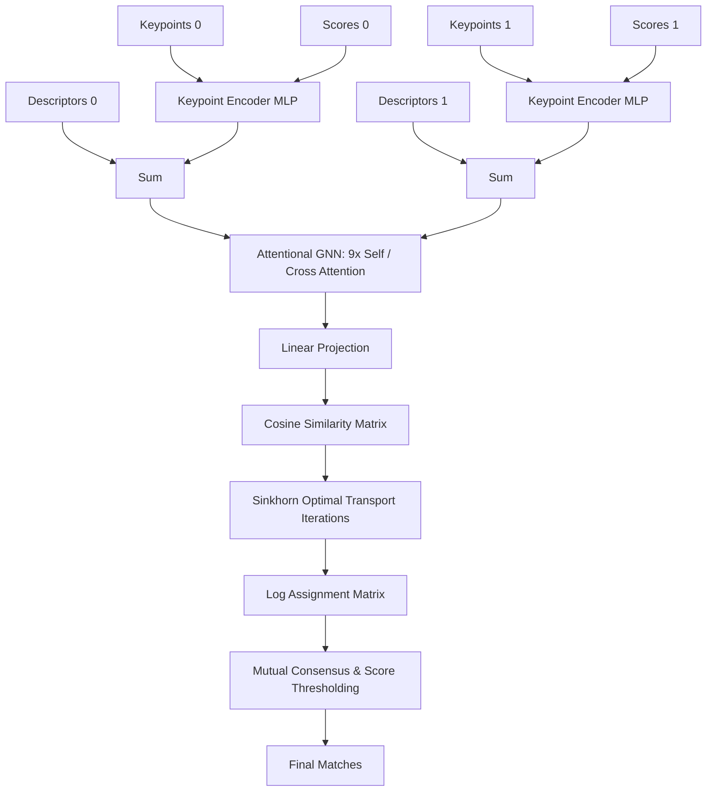

# Deep Learning Feature Matching Pipeline: System Architecture & Training Details

This report provides a detailed breakdown of the custom SuperPoint and SuperGlue feature detection and matching pipeline. The pipeline is designed for low-contrast, noisy outdoor environments using active **Ouster LiDAR sensor scans** projected into a camera pinhole projection format.

---

## 1. System Architecture Overview

The end-to-end pipeline consists of three core phases: **Joint Multimodal Dataset Bootstrapping (pseudo-ground-truth generation)**, **SuperPoint Feature Model Training**, and **SuperGlue Graph Neural Network Matcher Training**.

---

## 2. LiDAR Image Modalities & Spatial Alignment

The input dataset is generated from Ouster LiDAR scans projected into a camera frame. Because all modalities are derived from the same raw laser sweep, they are **spatially aligned at the pixel level**.

| Modality | Physical Quantity Captured | Role in Pipeline / Keypoint Extraction |
| :--- | :--- | :--- |
| **Near-IR (`nearir`)** | Active ambient infrared light intensity returned to the sensor. | Captures rich ambient texture, mimicking standard photographic cameras. |
| **Range (`range`)** | Radial distance (depth) from the sensor. | Encodes geometry; critical for Z-buffered 3D perspective warping. |
| **Reflectivity (`reflectivity`)** | Active retro-reflective properties of surfaces (material-specific). | Captures visual markers independent of sunlight/ambient illumination. |
| **Signal (`signal`)** | Return pulse intensity (reflectivity decaying with distance). | Provides extremely sharp, high-contrast edges and corner structures. |

---

## 3. Dataset Creation & Pre-extraction Pipeline

Because the dataset size is small (~300 images) and deep neural network training requires stable signals, the pipeline implements a multi-step **self-supervised consensus bootstrapping workflow**:

### Step 3.1: Joint Multimodal Homographic Adaptation (MHA)
Homographic Adaptation is a self-supervised technique that runs a base model on multiple transformed views of an image, back-projects the detections, and averages them to find stable keypoints.
1. **Warp Modes**:
   * **2D Homography**: Perturbs the four corners of the image boundary and applies perspective warping.
   * **3D Projective Warp**: Leverages the spatially aligned `range` image. Reconstructs 3D coordinates using camera intrinsics ($K$), applies a random 3D rigid transform $[R \vert t]$, resolves occlusions using a **Z-buffer (depth sorting)**, and projects points back to the image.
2. **Reprojection and Accumulation**: Keypoints detected in the warped image are mapped back to the original coordinates via the inverse projection mapping ($H^{-1}$ or 3D inverse transform).
3. **Repeatability Score**: Detections are accumulated into a joint multimodal heatmap. The accumulation is normalized by a trials map (which tracks how many times each pixel fell within the image boundary during warping):
   $$\text{Heatmap}(x, y) = \frac{\sum_{m \in \text{modalities}} \sum_{k=1}^N \text{Score}_{m,k}(x,y)}{\sum_{m \in \text{modalities}} \sum_{k=1}^N \mathbb{1}[\text{visible}_{m,k}(x,y)]}$$
4. **NMS**: Non-Maximum Suppression (NMS radius = 4) isolates distinct local maxima, which are saved to `pseudo_labels.h5`.

### Step 3.2: consensus Descriptor Caching
To train SuperGlue, we require the descriptor space of our custom-trained SuperPoint model. We pre-extract and cache these features:
1. Load the fine-tuned SuperPoint weights.
2. Feed the `reflectivity` image through the custom SuperPoint VGG backbone to compute dense feature maps.
3. Sample 256-dimensional descriptors at the consensus keypoints (`pseudo_labels.h5`) using **bilinear interpolation** (`torch.nn.functional.grid_sample`) with a stride of 8.
4. Save the keypoints, confidence scores, and descriptors to `custom_dataset_consensus_SP.h5` to serve as the inputs for SuperGlue training.

---

## 4. Detailed Data Loading Mechanism

The dataloader is built on `gluefactory.datasets.homographies.HomographyDataset` and handles on-the-fly homography estimation and feature loading:

### 4.1 On-the-Fly Image Pairs Generation
For each step in the training loop, the dataloader:
1. Loads an image and normalizes it to $[0, 1]$.
2. Samples a random homography matrix $H$ representing camera rotation and perspective changes.
3. Warps the original image twice to generate `view0` and `view1` patches of shape `[512, 208]`.
4. Computes the relative ground-truth homography matrix $H_{0 \to 1}$ between the two views.
5. Applies photometric augmentations (light/dark levels and contrast changes).

### 4.2 Cache Loading and Keypoint Warping
* **CacheLoader**: Loads the pre-extracted consensus keypoints, scores, and descriptors from the cached H5 file corresponding to the base image.
* **Keypoint Warping**: The cached keypoints are warped to the coordinates of `view0` and `view1` using the forward homographies.
* **Out-of-Bounds Filtering**: Keypoints that warp outside the patch boundaries are discarded.
* **Top-K Sorting and Padding**: The remaining keypoints are sorted by score. The top 512 keypoints are selected and padded with zero-scores/random-coordinates if fewer than 512 keypoints are visible, ensuring a static shape for batching.

---

## 5. Model Architectures & Applied Methods

### 5.1 SuperPoint Network Architecture & Joint Loss
SuperPoint is a joint detector and descriptor network using a shared VGG-style encoder backbone:

* **Detector Head**: Evaluates an $8 \times 8$ grid of cells. It outputs 65 channels (representing the 64 pixels in the cell plus 1 "dustbin" channel indicating no keypoint).
* **Descriptor Head**: Outputs a dense semi-dense tensor of shape $H/8 \times W/8 \times 256$, which is L2-normalized.
* **Joint Training Loss**:
  $$\mathcal{L}_{\text{total}} = \mathcal{L}_{\text{detector}} + \lambda_d \mathcal{L}_{\text{descriptor}}$$
  * **Detector Loss**: Multi-class Cross-Entropy against the pseudo-ground-truth targets.
  * **Descriptor Loss**: A grid-based contrastive hinge loss. Cell centers from `view0` are warped to `view1`. If the distance is $<8.0\text{px}$, they are positive pairs ($Y=1$); otherwise, they are negative pairs ($Y=0$):
    $$\mathcal{L}_{\text{pos}} = Y \cdot \max(0, 1 - S) \quad \text{and} \quad \mathcal{L}_{\text{neg}} = (1 - Y) \cdot \max(0, S - 0.2)$$
    where $S$ is the cosine similarity between the sampled descriptors.

---

### 5.2 SuperGlue Network Architecture & Loss
SuperGlue is a graph neural network matcher that predicts matches between keypoints using self- and cross-attention:

1. **Keypoint Encoder**: Maps normalized coordinates $[-1, 1]$ and confidence scores into a 256-D embedding using a multi-layer perceptron (MLP). The embedding is added directly to the visual descriptor.
2. **Attentional GNN**: Features propagate through 9 layers of alternating self-attention (comparing features within the same image) and cross-attention (comparing features between images).
3. **Optimal Transport (Sinkhorn)**: Predicts matches by adding a learnable "dustbin" column and row to the similarity matrix, then running 50 Sinkhorn iterations to compute a doubly stochastic assignment matrix.
4. **Balanced NLL Loss**:
   $$\mathcal{L}_{\text{assignment}} = \alpha \cdot \text{NLL}_{\text{pos}} + (1 - \alpha) \cdot \text{NLL}_{\text{neg}}$$
   where $\text{NLL}_{\text{pos}}$ evaluates matched keypoint probabilities and $\text{NLL}_{\text{neg}}$ evaluates the dustbin assignment for unmatched keypoints.
